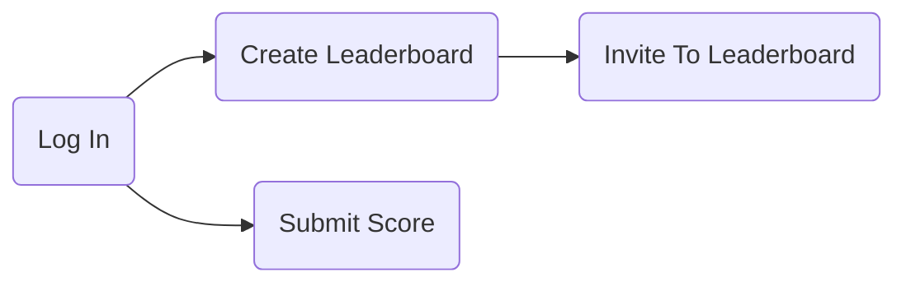

# wordleboard

Welcome to wordleboard, a platform where you can easily create leaderboards and compete with your friends to see who can guess the mystery word in the fewest number of tries in the game of [Wordle](https://www.nytimes.com/games/wordle/index.html).
Share your leaderboard with your friends and colleagues and watch as the competition heats up!

- ASP.NET 6.0 
- Identity
- SQL

